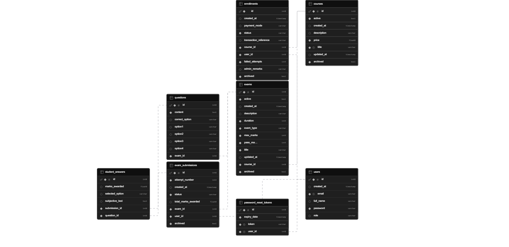

<div align="center">

# ExamHub — Online Exam Management System

**A production-grade, full-stack examination platform built for real-world use.**

</div>

---

## 📋 Table of Contents

- [Overview](#overview)
- [Features](#features)
- [Tech Stack](#tech-stack)
- [Architecture](#architecture)
- [Database Schema](#database-schema)
- [API Reference](#api-reference)
- [Getting Started](#getting-started)
- [Environment Variables](#environment-variables)
- [Deployment](#deployment)
- [Project Structure](#project-structure)

---

## Overview

ExamHub is a client-facing online examination management system designed to replace manual, paper-based assessment workflows. It supports two distinct user roles — **Admin** and **Student** — each with their own fully isolated domain, dashboard, and feature set.

The platform handles the complete examination lifecycle: course creation and enrollment, exam scheduling, real-time proctoring controls, automated grading, certificate generation, and detailed result tracking.

> Built as a commissioned project for a real client and deployed to production.

---

## Features

### 👩‍🎓 Student Features
- **Course Enrollment** — Browse available courses and submit enrollment requests
- **Exam Interface** — Timed, full-screen exam experience with question navigation panel
- **Save-As-You-Go** — Answers auto-save to the database on every selection — no data loss on page refresh
- **Tab-Switch Detection** — 3-warning system; third violation triggers automatic exam submission
- **MCQ & Subjective Support** — Handles both objective (auto-graded) and descriptive (admin-graded) exams
- **Instant Results** — MCQ results displayed immediately after submission with pass/fail status
- **Dashboard** — View enrolled courses, exam history, scores, and downloadable certificates

### 🛠️ Admin Features
- **Course Management** — Create, update, archive, and manage course catalog
- **Exam Builder** — Create timed exams with configurable pass marks, max marks, and exam type
- **Question Bank** — Add MCQ and subjective questions per exam with correct answer mapping
- **Pending Enrollments** — Approve or reject student enrollment requests
- **Student Directory** — View all registered students and their enrollment status
- **Subjective Grading Portal** — Review and grade submitted descriptive answers per question
- **3-Strike Lockout Management** — View and manually unlock students locked out after 3 failed attempts
- **Transaction History** — Track all enrollment and payment activity
- **QR Code Settings** — Manage QR code configuration for course access
- **Archived Items** — View and restore archived courses and exams

### 🔐 Security Features
- Stateless JWT authentication with configurable expiry
- Role-Based Access Control (RBAC) — strict separation of Admin and Student domains
- BCrypt password hashing
- Secure password reset via email with UUID tokens and 15-minute expiry (one-time use)
- Spring Security filter chain — every request validated before reaching controllers
- Admin registration protected by a secret registration code

---

## Tech Stack

### Backend
| Technology | Purpose |
|---|---|
| Java 21 | Core language |
| Spring Boot 3 | Application framework |
| Spring Security | Authentication & authorisation |
| Spring Data JPA | ORM and database abstraction |
| Hibernate | JPA implementation |
| JWT (jjwt) | Stateless token-based auth |
| PostgreSQL | Primary relational database |
| Supabase | Managed PostgreSQL hosting |
| HikariCP | Database connection pooling |
| JavaMailSender | Password reset email delivery |
| Lombok | Boilerplate reduction |
| Maven | Build tool |

### Frontend
| Technology | Purpose |
|---|---|
| React 18 | UI framework |
| React Router v6 | Client-side routing |
| Tailwind CSS | Utility-first styling |
| Axios | HTTP client with interceptors |
| Context API | Auth and theme state management |
| Vite | Build tool and dev server |

### DevOps & Infrastructure
| Technology | Purpose |
|---|---|
| Docker | Containerisation |
| Docker Compose | Multi-service orchestration |
| Vercel | Frontend deployment (SPA with rewrite rules) |
| Railway | Backend deployment |
| GitHub | Version control |

---

## Architecture

```
┌─────────────────────────────────────────────────────────────┐
│                        CLIENT BROWSER                        │
│              React SPA — deployed on Vercel                  │
│   ┌──────────────┐              ┌──────────────────────┐    │
│   │  AuthContext  │              │    React Router       │    │
│   │  (JWT store)  │              │  ProtectedRoute RBAC  │    │
│   └──────────────┘              └──────────────────────┘    │
└──────────────────────┬──────────────────────────────────────┘
                       │  HTTPS — Bearer Token
                       ▼
┌─────────────────────────────────────────────────────────────┐
│              Spring Boot Backend — deployed on Railway        │
│                                                               │
│   ┌───────────┐   ┌───────────┐   ┌────────────────────┐   │
│   │ JwtFilter  │ → │Controller │ → │   Service Layer     │   │
│   │(Auth check)│   │  (REST)   │   │ (Business Logic)    │   │
│   └───────────┘   └───────────┘   └────────────────────┘   │
│                                            │                  │
│   ┌──────────────────────────────────────┐│                  │
│   │         Spring Security              ││                  │
│   │  CORS · CSRF disabled · STATELESS    ││                  │
│   │  URL-level RBAC rules                ││                  │
│   └──────────────────────────────────────┘│                  │
│                                            ▼                  │
│                              ┌─────────────────────┐        │
│                              │   Repository Layer   │        │
│                              │   (Spring Data JPA)  │        │
│                              └─────────────────────┘        │
└──────────────────────────────────────┬──────────────────────┘
                                       │
                                       ▼
┌─────────────────────────────────────────────────────────────┐
│           PostgreSQL — hosted on Supabase                    │
│         HikariCP connection pool (max 5 connections)         │
└─────────────────────────────────────────────────────────────┘
```

### Key Design Patterns
- **Controller → Service → Repository → Entity** — strict layered architecture
- **Interface + Implementation** — all services defined as interfaces (`AuthService` / `AuthServiceImpl`) following Dependency Inversion
- **DTO pattern** — separate request/response objects, entities never exposed directly over the API
- **Mapper layer** — explicit conversion between entities and DTOs
- **GlobalExceptionHandler** — centralised `@RestControllerAdvice` for consistent error responses across all endpoints

---

## Database Schema



### Tables Overview

| Table | Description |
|---|---|
| `users` | Stores all registered users with role (STUDENT / ADMIN), hashed password, and timestamps |
| `courses` | Course catalog with title, description, price, and active/archived status |
| `enrollments` | Junction table between users and courses — tracks status, failed attempts, and payment info |
| `exams` | Exam definitions linked to a course — type (MCQ/SUBJECTIVE), duration, max and pass marks |
| `questions` | Question bank per exam — stores content, 4 options, and correct answer for MCQ |
| `exam_submissions` | One record per student per exam attempt — tracks status (PENDING/PASSED/FAILED) and total marks |
| `student_answers` | Individual answer records per question per submission — stores selected option or subjective text |
| `password_reset_tokens` | One-time UUID tokens for password reset with expiry timestamp |

### Key Relationships
- `users` → `enrollments` → `courses` — many-to-many via enrollment junction
- `courses` → `exams` → `questions` — hierarchical course structure
- `exam_submissions` links `users` + `exams` — one submission per student per exam (enforced at service layer)
- `student_answers` links `exam_submissions` + `questions` — one answer record per question, supports upsert for save-as-you-go

---

## API Reference

### Auth — `/api/v1/auth` (Public)

| Method | Endpoint | Description |
|---|---|---|
| `POST` | `/register` | Register a new user (Student or Admin with secret code) |
| `POST` | `/login` | Authenticate and receive JWT token |
| `POST` | `/forgot-password` | Send password reset email |
| `POST` | `/reset-password` | Reset password with valid token |

### Courses — `/api/v1/courses`

| Method | Endpoint | Role | Description |
|---|---|---|---|
| `GET` | `/` | STUDENT, ADMIN | List all active courses |
| `POST` | `/` | ADMIN | Create a new course |
| `PUT` | `/{id}` | ADMIN | Update course details |
| `DELETE` | `/{id}` | ADMIN | Archive a course |

### Enrollments — `/api/v1/enrollments`

| Method | Endpoint | Role | Description |
|---|---|---|---|
| `POST` | `/course/{courseId}` | STUDENT | Submit enrollment request |
| `GET` | `/user/{userId}` | STUDENT, ADMIN | Get enrollments for a user |
| `GET` | `/course/{courseId}` | ADMIN | Get all enrollments for a course |
| `PATCH` | `/{id}` | ADMIN | Approve or reject enrollment |
| `POST` | `/{id}/unlock` | ADMIN | Unlock student locked by 3-strike rule |

### Exams — `/api/v1/exams`

| Method | Endpoint | Role | Description |
|---|---|---|---|
| `GET` | `/course/{courseId}` | STUDENT, ADMIN | List exams for a course |
| `GET` | `/{id}` | STUDENT, ADMIN | Get exam details |
| `POST` | `/` | ADMIN | Create a new exam |
| `PATCH` | `/{id}` | ADMIN | Update exam settings |
| `DELETE` | `/{id}` | ADMIN | Archive an exam |

### Submissions — `/api/v1/submissions`

| Method | Endpoint | Role | Description |
|---|---|---|---|
| `POST` | `/start` | STUDENT | Start exam — creates submission record |
| `POST` | `/save-answer` | STUDENT | Save a single answer (upsert) |
| `POST` | `/submit/{examId}` | STUDENT | Finalise and grade submission |
| `GET` | `/my` | STUDENT | Get current user's submission history |
| `GET` | `/pending` | ADMIN | List all pending subjective submissions |
| `GET` | `/{id}` | STUDENT, ADMIN | Get detailed submission with answers |
| `POST` | `/grade` | ADMIN | Grade subjective exam answers |

---

## Getting Started

### Prerequisites
- Java 17+
- Node.js 18+
- Maven 3.8+
- PostgreSQL (or a Supabase project)
- Docker (optional)

### 1. Clone the repository

```bash
git clone https://github.com/Srijitadasgupta2003/online-exam-system.git
cd online-exam-system
```

### 2. Backend Setup

```bash
cd examserver
```

Create a `.env` file in the backend root (see [Environment Variables](#environment-variables)):

```bash
cp .env.example .env
# Fill in your values
```

Run the backend:

```bash
./mvnw spring-boot:run
```

The API will start at `http://localhost:8080`.

### 3. Frontend Setup

```bash
cd online-exam-frontend
npm install
```

Create a `.env` file:

```bash
VITE_API_BASE_URL=http://localhost:8080/api/v1
```

Start the development server:

```bash
npm run dev
```

The app will be available at `http://localhost:5173`.

### 4. Using Docker Compose (Full Stack)

```bash
# From the project root
docker-compose up --build
```

- Frontend: `http://localhost:3000`
- Backend: `http://localhost:8080`

---

## Environment Variables

### Backend (`.env`)

```env
# Database
DB_URL=jdbc:postgresql://<host>:<port>/postgres?prepareThreshold=0
DB_USERNAME=your_db_username
DB_PASSWORD=your_db_password

# JWT
JWT_SECRET=your_base64_encoded_secret

# Admin Registration
ADMIN_REGISTRATION_CODE=your_secret_admin_code

# Email (Gmail SMTP)
MAIL_USERNAME=your_email@gmail.com
MAIL_PASSWORD=your_gmail_app_password

# CORS
CORS_ALLOWED_ORIGINS=http://localhost:5173
```

> ⚠️ **Never commit your `.env` file.** It is listed in `.gitignore`. For production, set all variables directly in your hosting platform's environment dashboard.

### Frontend (`.env`)

```env
VITE_API_BASE_URL=https://your-backend-url/api/v1
```

---

## Deployment

### Frontend — Vercel

1. Push the frontend folder to GitHub
2. Import the repository in Vercel
3. Set `VITE_API_BASE_URL` in Vercel environment variables
4. Vercel auto-deploys on every push to `main`

The `vercel.json` at the project root handles SPA routing:

```json
{
  "rewrites": [
    { "source": "/(.*)", "destination": "/index.html" }
  ]
}
```

> This is required because the app uses `BrowserRouter`. Without it, direct URL access and page refreshes return 404.

### Backend — Railway (or any Docker host)

1. Push the backend to GitHub
2. Create a new Railway project → Deploy from GitHub
3. Set all environment variables in Railway's dashboard (not in `.env`)
4. Railway auto-deploys on push

Alternatively, use the included `Dockerfile`:

```bash
docker build -t examhub-backend .
docker run -p 8080:8080 --env-file .env examhub-backend
```

---

## Project Structure

```
online-exam-system/
│
├── examserver/                        # Spring Boot backend
│   ├── src/main/java/com/examhub/
│   │   ├── config/                    # SecurityConfig, AppConfig, JwtFilter
│   │   ├── controller/                # REST controllers + GlobalExceptionHandler
│   │   ├── domain/
│   │   │   ├── dto/                   # Request/response DTOs (Java Records)
│   │   │   ├── entity/                # JPA entities
│   │   │   └── enums/                 # Role, ExamType, EnrollmentStatus, SubmissionStatus
│   │   ├── exception/                 # Custom exception classes
│   │   ├── mapper/                    # Entity ↔ DTO converters
│   │   ├── repository/                # Spring Data JPA repositories
│   │   ├── security/                  # CustomUserDetailsService
│   │   └── service/                   # Service interfaces + implementations
│   ├── src/main/resources/
│   │   └── application.properties
│   └── Dockerfile
│
├── online-exam-frontend/              # React frontend
│   ├── src/
│   │   ├── api/                       # Axios instance with interceptors
│   │   ├── components/
│   │   │   ├── auth/                  # ProtectedRoute
│   │   │   ├── layout/                # Sidebar
│   │   │   └── student/               # CourseCard
│   │   ├── context/                   # AuthContext, ThemeContext
│   │   ├── pages/
│   │   │   ├── admin/                 # AdminDashboard, CourseManagement, SubjectiveGrading, etc.
│   │   │   ├── auth/                  # Login, Register, ForgotPassword, ResetPassword
│   │   │   └── student/               # Dashboard, CourseExams, TakeExam
│   │   ├── App.jsx                    # Route definitions
│   │   └── main.jsx                   # App entry point
│   ├── vercel.json                    # SPA rewrite rule
│   └── Dockerfile
│
└── docker-compose.yml                 # Full stack orchestration
```

---

## License

This project was developed as a commissioned client project. All rights reserved.

---

<div align="center">
  <strong>Built with ☕ Java and ⚛️ React</strong><br/>
  <a href="https://online-exam-system-zeta-five.vercel.app">View Live Demo</a>
</div>
